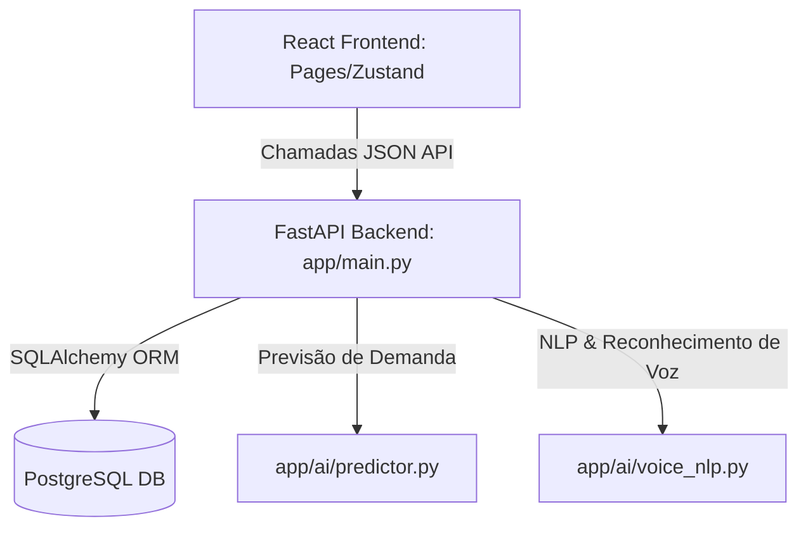

# 🧠 VoxFatura AI — Motor Backend Preditivo

Este é o repositório do **Backend Engine** do **VoxFatura AI** — uma plataforma inteligente de faturação assistida por voz e inteligência artificial preditiva.

O motor backend é desenvolvido em **Python** utilizando **FastAPI**, com persistência de dados em **PostgreSQL** local e modelos de Machine Learning (ML) executados localmente através da biblioteca **scikit-learn**.

---

## 🏗️ Arquitetura do Sistema



### Tecnologias Utilizadas
* **Framework Web:** FastAPI (alta performance, tipagem estática e documentação OpenAPI interativa automática)
* **Base de Dados:** PostgreSQL (Instalado localmente, escutando na porta `5434`)
* **ORM:** SQLAlchemy com migrações e mapeamento declarativo
* **Modelos de IA Locais:**
  * **Fuzzy Database Matching:** Correspondência semântica e fonética aproximada de termos falados em português angolano para identificação de produtos e clientes
  * **Regressão Linear (scikit-learn):** Previsão de demanda, velocidade média de vendas e dias até rutura de stock com base em séries temporais
  * **Isolation Forest (scikit-learn):** Deteção de anomalias financeiras e padrões de compra atípicos de clientes

---

## 🛠️ Como Iniciar o Backend

### 1. Requisitos Prévios
* Python 3.10 ou superior
* PostgreSQL 16 instalado no sistema

### 2. Iniciar a Base de Dados PostgreSQL
O cluster de dados está localizado na diretoria `back/db_data/` e configurado para rodar na porta local `5434`.

```bash
# Iniciar o PostgreSQL local
/usr/lib/postgresql/16/bin/pg_ctl -D db_data start
```

*Para verificar o estado do servidor PostgreSQL:*
```bash
/usr/lib/postgresql/16/bin/pg_ctl -D db_data status
```

### 3. Configurar e Ativar o Ambiente Virtual
O backend utiliza um ambiente virtual (`venv`) para isolar as dependências:

```bash
# Ativar o ambiente virtual
source venv/bin/activate

# Instalar dependências (caso necessário)
pip install -r requirements.txt
```

### 4. Inicializar e Popular a Base de Dados
Para recriar a estrutura de tabelas relacionais do PostgreSQL e popular com os dados reais iniciais do projeto:

```bash
python db_init.py
```

### 5. Iniciar o Servidor FastAPI
Execute o Uvicorn com hot-reload ativo para desenvolvimento:

```bash
uvicorn app.main:app --host 0.0.0.0 --port 8000 --reload
```

O servidor estará ativo em: **`http://localhost:8000`**
* Documentação Swagger Interativa: **`http://localhost:8000/docs`**
* Documentação ReDoc: **`http://localhost:8000/redoc`**

---

## 🐳 Como Iniciar via Docker (Recomendado 🚀)

O backend possui suporte completo e otimizado a **Docker** e **Docker Compose**, separando a aplicação FastAPI e a base de dados PostgreSQL em containers isolados seguindo as melhores práticas.

### 1. Iniciar os Serviços
Para subir a base de dados e a API FastAPI em segundo plano, basta executar o seguinte comando dentro da pasta `/back`:

```bash
docker compose up -d
```

Este comando irá:
1. Descarregar a imagem oficial do **PostgreSQL 15 Alpine**.
2. Compilar a imagem customizada para o motor do **FastAPI em Python 3.12-slim**.
3. Iniciar o Postgres na porta interna `5432` e mapear a porta `5434` para o seu computador local (mantendo a compatibilidade).
4. Executar o script de arranque inteligente `start.sh`, que aguarda a base de dados estar operacional, inicializa as tabelas relacionais do PostgreSQL (se vazias, mantendo os dados persistidos nos reinícios) e roda o Uvicorn na porta `8000`.

### 2. Verificar o Estado dos Containers
```bash
docker compose ps
```

### 3. Visualizar logs em Tempo Real
```bash
docker compose logs -f
```

### 4. Parar os Serviços
```bash
docker compose down
```

---

## 📡 Referência Rápida da API

### 👥 Clientes
* `GET /api/clientes` — Retorna a lista de todos os clientes no PostgreSQL
* `POST /api/clientes` — Cria um novo cliente
* `PUT /api/clientes/{id}` — Atualiza os dados cadastrais de um cliente

### 📦 Produtos & Inventário
* `GET /api/produtos` — Retorna a lista de produtos e níveis de stock
* `POST /api/produtos` — Cadastra um novo produto
* `PUT /api/produtos/{id}` — Atualiza dados e preços do produto

### 🧾 Faturas
* `GET /api/faturas` — Lista todas as faturas (confirmadas e rascunhos)
* `POST /api/faturas` — Cria e confirma uma fatura, atualizando o stock de produtos e saldos de crédito do cliente no PostgreSQL

### 🔮 Inteligência Artificial (AI)
* `POST /api/ai/voice-command` — Processa transcrições de comandos de voz e retorna ações estruturadas da fatura (`SET_CLIENT`, `ADD_ITEM`, `CONFIRM_INVOICE`)
* `GET /api/ai/prediction/demand/{product_id}` — Treina e executa regressão linear scikit-learn para prever vendas e stock-out
* `GET /api/ai/business-insights` — Retorna análises macro de faturamento, score de saúde de inventário e deteção de churn
